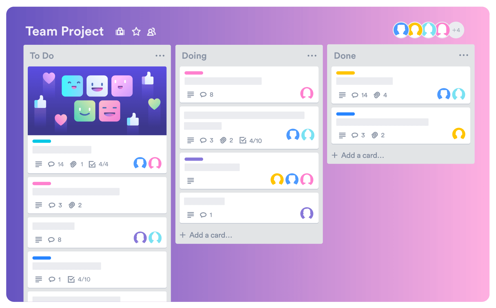

# Project Trello With Java Core

Simple Trello application. This project is made using IntelliJ IDEA and Java programming language.

## What is Trello?

Trello is the visual tool that empowers your team to manage any type of project, workflow, or task tracking. Add files, checklists, or even automation: Customize it all for how your team works best.

